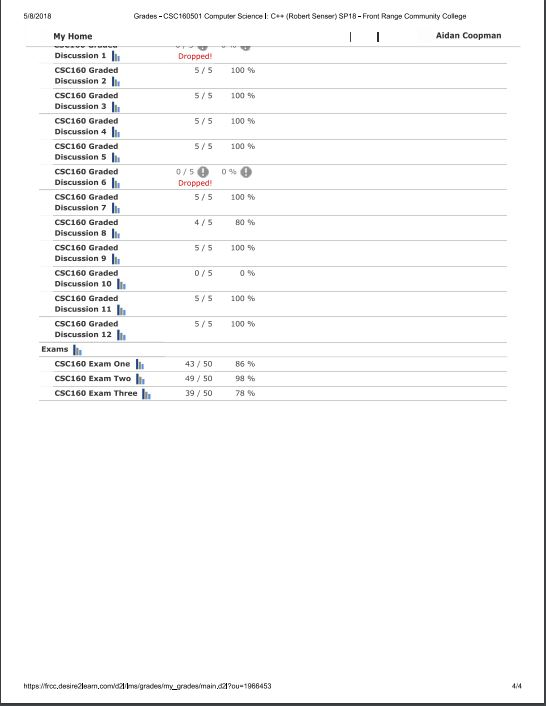

# CS160_Savitch_Assignments

I am taking CS160 at Front Range Collage and here are the assignments that was for homework.

For a good template that shows all the features off c++ look at lesson 11 and the VectorDouble class

